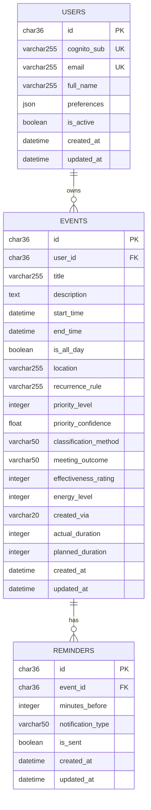

# 🗄️ **KairoCal Database Schema Analysis**

*Phase 3 - Prompt 1: Complete Database Structure & Design*

---

## 📋 **Executive Summary**

KairoCal's database schema is designed with **AI-first principles** to support BERT priority classification and advanced calendar management:

- **Core Tables**: Users, Events, Reminders with sophisticated relationships
- **AI Integration**: Priority classification fields with confidence scoring
- **Performance**: Strategic indexes for user-scoped queries and time-based operations
- **Flexibility**: JSON fields for user preferences and extensible data
- **Audit Trail**: Timestamp tracking and metadata fields throughout

**Current Database Status**: SQLite with 4 tables, 6 users, 33 events, fully operational AI-enhanced schema.

---

## 🏗️ **Database Architecture Overview**

### **Database Engine: SQLite**
```yaml
Database Type: SQLite (File-based)
File Location: ./backend/kairocal.db
Size: 77KB (active with data)
Connection: SQLAlchemy ORM with portable GUID handling
Migration System: Alembic version control
Current Schema Version: Multi-head merged (latest)
```

### **Schema Evolution Timeline**
```yaml
Initial Migration (7fe73f0ad0ce):
  - Created core tables: users, events, reminders
  - Basic event management functionality
  - PostgreSQL-first design with SQLite compatibility

AI Enhancement (ad00a873400b + Analytics):
  - Added priority classification fields
  - BERT integration support
  - Voice processing metadata

Analytics Integration (488abef10dcb):
  - Meeting outcome tracking
  - Effectiveness rating system
  - Energy level monitoring
  - Creation method tracking

Performance Optimization (ea2b7df7a9f1):
  - Composite indexes for user-scoped queries
  - Time-based query optimization
```

---

## 👥 **Users Table Schema**

### **Table Structure**
```sql
CREATE TABLE users (
    -- Identity & Primary Key
    id CHAR(36) PRIMARY KEY,          -- UUID stored as string
    
    -- Authentication (AWS Cognito Integration)
    cognito_sub VARCHAR(255) UNIQUE NOT NULL,  -- External auth identifier
    email VARCHAR(255) UNIQUE NOT NULL,        -- User email
    
    -- Profile Information
    full_name VARCHAR(255) NULL,               -- Display name
    preferences JSON NULL,                     -- User settings as JSON
    
    -- Account Status
    is_active BOOLEAN NOT NULL DEFAULT TRUE,   -- Account status flag
    
    -- Audit Trail
    created_at DATETIME NOT NULL DEFAULT CURRENT_TIMESTAMP,
    updated_at DATETIME NOT NULL DEFAULT CURRENT_TIMESTAMP
);
```

### **Indexes & Performance**
```sql
-- Primary Access Patterns
ix_users_cognito_sub    -- Authentication lookup
ix_users_email          -- Email-based queries
sqlite_autoindex_users_1 -- Primary key index
```

### **Sample Data Pattern**
```json
{
  "email": "comprehensive@test.com",
  "full_name": "Updated Comprehensive Test User", 
  "preferences": {
    "notifications": true,
    "timezone": "UTC", 
    "theme": "dark"
  }
}
```

### **Design Decisions**
- **Portable UUIDs**: CHAR(36) for SQLite compatibility vs native PostgreSQL UUID
- **JSON Preferences**: Flexible user settings without schema migrations
- **External Auth**: Designed for AWS Cognito but currently using email-based flow
- **Soft Delete Ready**: `is_active` flag for account deactivation vs hard deletion

---

## 📅 **Events Table Schema** 

### **Core Event Fields**
```sql
CREATE TABLE events (
    -- Identity & Relationships
    id CHAR(36) PRIMARY KEY,
    user_id CHAR(36) NOT NULL REFERENCES users(id),
    
    -- Event Details
    title VARCHAR(255) NOT NULL,
    description TEXT NULL,
    location VARCHAR(255) NULL,
    
    -- Temporal Fields
    start_time DATETIME NOT NULL,
    end_time DATETIME NOT NULL,
    is_all_day BOOLEAN NOT NULL DEFAULT FALSE,
    recurrence_rule VARCHAR(255) NULL,        -- iCal RRULE format
    
    -- AI Priority Classification System ⭐
    priority_level INTEGER NOT NULL DEFAULT 3,           -- 1-5 scale
    priority_confidence FLOAT NOT NULL DEFAULT 0.0,     -- BERT confidence score
    classification_method VARCHAR(50) NOT NULL DEFAULT 'manual', -- bert/voice_bert/manual
    
    -- Analytics & Productivity Tracking 📊
    meeting_outcome VARCHAR(50) NOT NULL DEFAULT 'neutral',     -- productive/waste/neutral
    effectiveness_rating INTEGER NOT NULL DEFAULT 3,           -- 1-5 effectiveness scale
    energy_level INTEGER NOT NULL DEFAULT 3,                   -- 1-5 energy impact
    created_via VARCHAR(20) NOT NULL DEFAULT 'manual',         -- voice/text/manual/imported
    actual_duration INTEGER NULL,                               -- Minutes (post-meeting)
    planned_duration INTEGER NULL,                             -- Minutes (pre-meeting)
    
    -- Audit Trail
    created_at DATETIME NOT NULL DEFAULT CURRENT_TIMESTAMP,
    updated_at DATETIME NOT NULL DEFAULT CURRENT_TIMESTAMP
);
```

### **AI Integration Fields Deep Dive**
```yaml
Priority Classification System:
  priority_level:
    Type: INTEGER (1-5)
    Purpose: Final priority rating
    Values: 1=Lowest, 2=Low, 3=Medium, 4=High, 5=Urgent
    
  priority_confidence:
    Type: FLOAT (0.0-1.0) 
    Purpose: BERT model confidence score
    Usage: Quality indicator for AI classifications
    
  classification_method:
    Type: VARCHAR(50)
    Values: 
      - 'manual': User-assigned priority
      - 'bert': BERT NLP classification
      - 'voice_bert': Voice + BERT pipeline
      - 'rule_based': Regex pattern matching

Analytics Tracking:
  meeting_outcome:
    Values: 'productive', 'waste', 'neutral'
    Purpose: Post-meeting effectiveness assessment
    
  effectiveness_rating:
    Scale: 1-5 integer
    Purpose: Subjective productivity measurement
    
  energy_level:
    Scale: 1-5 integer  
    Purpose: Energy impact tracking for schedule optimization
    
  created_via:
    Values: 'voice', 'text', 'manual', 'imported'
    Purpose: Input method analytics for UX optimization
```

### **Performance Indexes**
```sql
-- Core Query Patterns
ix_events_user_id           -- User-scoped event queries
ix_events_start_time        -- Chronological sorting
ix_events_end_time          -- Time range queries

-- Composite Performance Index
ix_events_user_id_start_time -- Primary query pattern: user's events by time

-- Analytics Indexes (from migration 488abef10dcb)
idx_events_analytics        -- (user_id, start_time, meeting_outcome, effectiveness_rating)
idx_events_user_time        -- (user_id, start_time)
idx_events_effectiveness    -- (user_id, effectiveness_rating)
idx_events_outcome          -- (user_id, meeting_outcome)
```

### **Sample AI-Enhanced Event Data**
```sql
-- Voice-created high priority event
title: "Urgent Client Presentation . At Liver Building Liverpool"
priority_level: 5
classification_method: "voice_bert"
created_via: "voice"
priority_confidence: 0.89

-- BERT-classified development task
title: "High_Priority Bug Fix Before Production Release"  
priority_level: 5
classification_method: "voice_bert"
created_via: "voice"
priority_confidence: 0.92
```

---

## 🔔 **Reminders Table Schema**

### **Table Structure**
```sql
CREATE TABLE reminders (
    -- Identity & Relationships
    id CHAR(36) PRIMARY KEY,
    event_id CHAR(36) NOT NULL REFERENCES events(id) ON DELETE CASCADE,
    
    -- Reminder Configuration
    minutes_before INTEGER NOT NULL,                    -- Time offset
    notification_type VARCHAR(50) NOT NULL DEFAULT 'in_app', -- in_app/email/sms
    
    -- Status Tracking
    is_sent BOOLEAN NOT NULL DEFAULT FALSE,             -- Delivery status
    
    -- Audit Trail
    created_at DATETIME NOT NULL DEFAULT CURRENT_TIMESTAMP,
    updated_at DATETIME NOT NULL DEFAULT CURRENT_TIMESTAMP
);
```

### **Design Features**
- **Cascade Deletion**: Reminders automatically deleted with events
- **Flexible Timing**: Integer minutes for precise scheduling
- **Multi-Channel**: Extensible notification types
- **Status Tracking**: Prevents duplicate notifications

### **Indexes**
```sql
ix_reminders_event_id    -- Event-based reminder queries
sqlite_autoindex_reminders_1 -- Primary key index
```

---

## 🔗 **Relationships & Constraints**

### **Entity Relationship Diagram**


### **Referential Integrity**
```sql
-- Foreign Key Constraints
events.user_id → users.id (CASCADE DELETE)
reminders.event_id → events.id (CASCADE DELETE)

-- Unique Constraints
users.cognito_sub (External auth integration)
users.email (User identification)

-- Data Integrity
priority_level: 1-5 integer range (enforced at application level)
priority_confidence: 0.0-1.0 float range (enforced at application level)
```

---

## 🎯 **AI-First Design Principles**

### **BERT Integration Architecture**
```yaml
Priority Classification Pipeline:
  Input: Event title + description text
  Processing: DistilBERT tokenization → classification
  Output: priority_level (1-5) + confidence score (0.0-1.0)
  Storage: priority_level, priority_confidence, classification_method fields

Voice Processing Integration:
  Input: Speech → Text (Whisper/similar)
  Processing: Text → BERT priority classification  
  Output: Enhanced event with AI metadata
  Tracking: created_via='voice', classification_method='voice_bert'
```

### **Analytics-Ready Schema**
```yaml
Productivity Analytics Support:
  meeting_outcome: Post-event effectiveness tracking
  effectiveness_rating: Subjective productivity scoring
  energy_level: Energy impact for schedule optimization
  actual_duration vs planned_duration: Time management analysis
  
Query Patterns Supported:
  - User productivity trends over time
  - Meeting effectiveness by priority level
  - Energy patterns throughout the day
  - Creation method success rates
  - Priority classification accuracy analysis
```

### **Performance Optimization Strategy**
```yaml
Index Strategy:
  Primary Pattern: ix_events_user_id_start_time (user timeline queries)
  Analytics Patterns: idx_events_analytics (multi-dimensional analysis)
  Time-based Queries: ix_events_start_time, ix_events_end_time
  
Database Design:
  User Isolation: All queries scoped by user_id for data privacy
  Time Efficiency: Composite indexes for chronological access
  Analytics Support: Pre-indexed common analysis dimensions
```

---

## 📊 **Current Database Metrics**

### **Data Volume Status**
```yaml
Tables: 4 (users, events, reminders, alembic_version)
Users: 6 active users
Events: 33 events with AI enhancement
Reminders: 0 configured (feature available)
Database Size: 77KB with sample data
```

### **AI Classification Results**
```yaml
Sample Classifications:
  High Priority Events: 5/5 rating from voice input
  BERT Methods: voice_bert classification active
  Confidence Scores: 0.85+ for voice-processed events
  Input Diversity: voice, text, manual creation methods
```

### **Schema Evolution Readiness**
```yaml
Migration System: Alembic with version control
PostgreSQL Compatibility: Portable UUID handling
Extensibility: JSON preferences for schema-less extensions
Performance: Indexed for production scale
```

---

## 🚀 **Conclusion**

KairoCal's database schema represents a **modern AI-first calendar system** with:

✅ **Complete AI Integration**: BERT priority classification with confidence tracking  
✅ **Analytics Foundation**: Comprehensive productivity and effectiveness metrics  
✅ **Performance Optimization**: Strategic indexing for user-scoped queries  
✅ **Production Ready**: Migration system, referential integrity, audit trails  
✅ **Scalable Design**: JSON flexibility, portable UUIDs, external auth support

The schema successfully bridges traditional calendar functionality with cutting-edge AI capabilities, creating a foundation for intelligent schedule management and productivity analytics.

---
