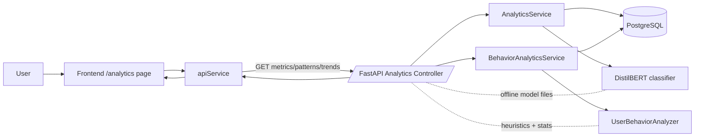
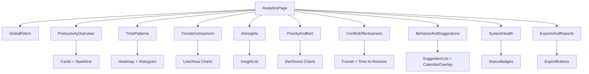

# Analytics Dashboard — Complete Implementation Plan

Date: 2025-08-11

This document is the definitive, self-contained guide for implementing the Analytics Dashboard in KairoCal. It explains the feature’s purpose, architecture, APIs, frontend design and components, data visualizations, UX, testing, and troubleshooting. A new contributor can use this alone to implement and validate the feature.

Assumptions used for examples
- API base path: /api/v1 (some deployments use /api/v1/analytics for this controller; paths below are relative and note both forms).
- Frontend: React + TypeScript (Vite), Tailwind CSS, no charting library installed yet.
- Backend: FastAPI, SQLAlchemy, Pydantic v2; PostgreSQL; Behavior analytics and a DistilBERT-based classifier available offline.


## 1. Feature overview

Purpose and academic importance
- The Analytics Dashboard surfaces explainable, longitudinal insights about scheduling efficiency, user behavior, conflict resolution effectiveness, and AI classifier performance.
- For academic evaluation (e.g., dissertation), it demonstrates: (1) metrics operationalization of productivity concepts, (2) hybrid human-AI scheduling outcomes, (3) ML model monitoring in real-time usage, and (4) behavior-aware recommendations.

Difference: main dashboard vs analytics dashboard
- Main Dashboard: operational day-to-day status (upcoming events, quick actions, lightweight metrics). Optimized for daily use.
- Analytics Dashboard: investigative, historical, and comparative analyses. Offers trends, correlations, model performance, conflict outcomes, and behavior-driven insights. Optimized for decision-making and research reporting.

Current implementation status (backend vs frontend)
- Backend: Comprehensive analytics endpoints exist and compute productivity metrics, patterns, AI insights, trends, classifier metrics, conflict effectiveness, and behavior insights/suggestions.
- Frontend: Minimal surface today (Priority Trends + BERT Performance cards). No dedicated analytics page, filters, or charts. This plan fills that gap.

Academic value proposition
- Aligns behavioral analytics with measurable scheduling outcomes and ML performance monitoring. Provides artifacts (metrics, charts, exports) suitable for experiments, ablation studies, and reproducibility.


## 2. Complete technical architecture

### 2.1 Backend API endpoints mapping (15+ endpoints)
The analytics controller exposes these endpoints (relative to basePath). Some deployments mount them under /api/v1/analytics; if so, prepend /analytics to the paths below. All support at least date range filters unless noted.

Core productivity and patterns
1) GET /analytics/productivity/metrics
2) GET /analytics/productivity/patterns
3) GET /analytics/productivity/insights
4) GET /analytics/dashboard/weekly-summary

AI and trends
5) GET /analytics/ai/insights
6) GET /analytics/trends/comparison
7) GET /analytics/priority/trends
8) GET /analytics/bert/performance

Conflicts effectiveness
9) GET /analytics/conflicts/resolution-effectiveness

Behavior analytics (user-scoped)
10) GET /analytics/user/{cognito_sub}/insights
11) GET /analytics/user/{cognito_sub}/time-suggestions
12) GET /analytics/user/{cognito_sub}/productivity-score
13) GET /analytics/user/{cognito_sub}/meeting-patterns
14) GET /analytics/user/{cognito_sub}/optimization-report

Health and misc
15) GET /analytics/health

Notes
- In some codebases, these are mounted under /api/v1 (without /analytics). Use OpenAPI to confirm in your environment.

### 2.2 Data flow diagrams

Mermaid: request flow


Mermaid: frontend composition


### 2.3 Frontend component structure
- Page: src/pages/analytics/AnalyticsPage.tsx
- Shared filters: src/components/analytics/GlobalFilters.tsx
- Sections (presentational + fetch hooks):
  - ProductivityOverview.tsx
  - TimePatterns.tsx
  - TrendsComparison.tsx
  - AiInsights.tsx
  - PriorityAndBert.tsx
  - ConflictEffectiveness.tsx
  - BehaviorAndSuggestions.tsx
  - SystemHealth.tsx
  - ExportsAndReports.tsx
- Hooks (data): src/hooks/analytics/
  - useAnalyticsFilters.ts (date range, granularity, compare)
  - useProductivityMetrics.ts, useTimePatterns.ts, useTrends.ts, usePriorityTrends.ts, useBertPerformance.ts, useConflictEffectiveness.ts, useBehaviorInsights.ts, useTimeSuggestions.ts, useHealth.ts
- API: extend src/services/apiService.ts for new methods.

### 2.4 Integration points with existing features
- DashboardPage currently renders a basic AnalyticsPanel; the dedicated /analytics page replaces and extends that content.
- Behavior analytics already powers smart-reschedule in conflicts; the same analyzer provides suggestions for the Analytics page.
- System Health card reuses existing /analytics/health endpoint.


## 3. Detailed page specification

Global Filters (persistent bar)
- Controls: date range (Last 7/14/30/90 days, custom), granularity (hour/day/week), user scope (current user or team aggregate if enabled), compare period toggle.

Nine content sections
1) Productivity Overview
- KPIs: overall_score, efficiency, utilization, focus, energy_management, duration_accuracy.
- Visual: KPI cards with delta vs previous period; small sparkline per KPI.

2) Time Patterns
- Visuals: (a) weekday vs hour heatmap of meeting density; (b) meeting duration histogram; (c) focus time distribution.
- Interactions: hover to reveal counts/percentages; click a cell to filter to that slice.

3) Trends & Comparisons
- Visuals: multi-line area chart for KPI trends; optional overlay of compare period.
- Interactions: zoom/pan over date range; legend toggle.

4) AI Insights
- Visuals: ordered list of generated insights with confidence; tags by theme (energy, overload, anomalies, correlations).
- Actions: copy to clipboard; export to JSON/CSV.

5) Priority & Classifier Performance
- Visuals: stacked bar for priority distribution; gauge/tiles for model precision/recall/F1; small ROC/PR curve if data available.
- Data: from /priority/trends and /bert/performance.

6) Conflict Resolution Effectiveness
- Visuals: funnel from detected -> auto-resolved -> user-resolved -> unresolved; line chart of time-to-resolve; bar of post-resolution satisfaction/effectiveness.

7) Behavior Insights & Smart Suggestions
- Visuals: list of suggested time slots (reason, score, confidence); small calendar overlay; behavior insights list.
- Actions: add to calendar, copy suggestion, filter by duration/preferred window.

8) System Health
- Visuals: status badges (OK/Warn/Error) for DB, NLP, cache; uptime; last data refresh.

9) Exports & Reports
- Actions: export current view to CSV/JSON; download chart as PNG; generate PDF report (client-side initially; server-side optional later).

Navigation and UX requirements
- Breadcrumbs: Home > Analytics.
- URL reflects filters using query params (?from=...&to=...&granularity=...).
- All sections respect global filters; section-level filters augment, never override silently.


## 4. Backend API documentation

Conventions
- Query parameters: from, to (ISO-8601 dates); granularity=hour|day|week; user=<cognito_sub> where applicable.
- All endpoints are GET unless noted. Responses are JSON.
- Example base path: /api/v1/analytics; if mounted at /api/v1, drop /analytics from examples.

Endpoint list with examples

1) GET /analytics/productivity/metrics
- Params: from, to, granularity (optional).
- Response example:
```json
{
  "overall_score": 78.6,
  "components": {
    "efficiency": 0.82,
    "utilization": 0.74,
    "focus": 0.71,
    "energy_management": 0.69,
    "duration_accuracy": 0.88
  },
  "trend_7d": [72.1,74.3,75.0,77.8,79.2,78.8,78.6],
  "interpretation": "Efficiency improving; energy dips on Wed afternoons"
}
```

2) GET /analytics/productivity/patterns
- Params: from, to.
- Response example:
```json
{
  "weekday_hour_heatmap": [{"weekday": 1, "hour": 9, "count": 3}, {"weekday": 3, "hour": 14, "count": 7}],
  "duration_histogram": [{"bucket": "0-15", "count": 2}, {"bucket": "30-45", "count": 9}],
  "focus_blocks": [{"start": "2025-08-04T09:00:00Z", "end": "2025-08-04T11:00:00Z", "score": 0.8}]
}
```

3) GET /analytics/productivity/insights
- Response example:
```json
{
  "insights": [
    {"id": "i1", "category": "energy", "text": "Higher energy between 9-11 AM.", "confidence": 0.84},
    {"id": "i2", "category": "anomaly", "text": "Spike in meetings on Wednesdays.", "confidence": 0.73}
  ]
}
```

4) GET /analytics/dashboard/weekly-summary
- Response example:
```json
{
  "week_start": "2025-08-04",
  "totals": {"meetings": 18, "focus_hours": 12.5, "avg_duration": 43},
  "highlights": ["Efficiency +5% WoW", "Fewer late-evening meetings"],
  "alerts": ["Two long meetings exceeded planned duration"]
}
```

5) GET /analytics/ai/insights
- Response example:
```json
{
  "insights": [
    {"type": "correlation", "detail": "Priority=High meetings have higher effectiveness", "support": 0.61},
    {"type": "optimization", "detail": "Shifting 30% of 4 PM meetings to 10 AM improves energy score", "support": 0.58}
  ]
}
```

6) GET /analytics/trends/comparison
- Params: metric=overall|efficiency|utilization|focus|energy|duration_accuracy; compare=true|false
- Response example:
```json
{
  "metric": "overall",
  "series": [{"date": "2025-08-01", "value": 74.1}, {"date": "2025-08-02", "value": 75.0}],
  "compare_series": [{"date": "2025-07-25", "value": 71.4}, {"date": "2025-07-26", "value": 72.2}]
}
```

7) GET /analytics/priority/trends
- Response example:
```json
{
  "distribution": [{"priority": "HIGH", "count": 42}, {"priority": "MEDIUM", "count": 113}, {"priority": "LOW", "count": 67}],
  "trend": [{"date": "2025-08-01", "high": 6, "medium": 18, "low": 7}],
  "adoption": {"classifier": 0.92, "manual": 0.08}
}
```

8) GET /analytics/bert/performance
- Response example:
```json
{
  "precision": 0.88,
  "recall": 0.85,
  "f1": 0.86,
  "support": 222,
  "last_evaluated": "2025-08-10T21:07:00Z",
  "notes": "DistilBERT offline model"
}
```

9) GET /analytics/conflicts/resolution-effectiveness
- Response example:
```json
{
  "funnel": {"detected": 31, "auto_resolved": 12, "user_resolved": 14, "unresolved": 5},
  "time_to_resolve": [{"bucket": "0-15m", "count": 8}, {"bucket": "15-60m", "count": 11}, {"bucket": ">60m", "count": 7}],
  "post_resolution_effectiveness": {"avg": 0.77, "n": 18}
}
```

10) GET /analytics/user/{cognito_sub}/insights
- Response example:
```json
{
  "patterns": [
    {"pattern": "Morning focus", "support": 0.7},
    {"pattern": "Avoid Friday late afternoon", "support": 0.6}
  ],
  "recommendations": ["Schedule high-priority tasks 9-11 AM"]
}
```

11) GET /analytics/user/{cognito_sub}/time-suggestions
- Params: duration_minutes (optional), window_start/window_end (optional ISO times of day)
- Response example:
```json
{
  "suggestions": [
    {
      "start": "2025-08-12T10:00:00Z",
      "end": "2025-08-12T10:30:00Z",
      "score": 0.82,
      "conflict_probability": 0.08,
      "reason": "High focus and low overlap risk"
    }
  ]
}
```

12) GET /analytics/user/{cognito_sub}/productivity-score
- Response example:
```json
{ "score": 0.79, "components": {"efficiency": 0.81, "focus": 0.72} }
```

13) GET /analytics/user/{cognito_sub}/meeting-patterns
- Response example:
```json
{
  "hours": [{"hour": 9, "avg_meetings": 1.1}],
  "days": [{"weekday": 3, "avg_meetings": 3.4}],
  "durations": [{"bucket": "30-45", "ratio": 0.52}]
}
```

14) GET /analytics/user/{cognito_sub}/optimization-report
- Response example:
```json
{
  "summary": "Shift recurring 4 PM sync to 10 AM for better energy and fewer conflicts",
  "estimated_gain": {"efficiency": 0.04, "focus": 0.03},
  "actions": ["Propose new time for Recurring Sync"]
}
```

15) GET /analytics/health
- Response example:
```json
{
  "database": "ok",
  "nlp": {"bert_available": true, "trained": true},
  "cache": "ok",
  "timestamp": "2025-08-11T10:00:00Z"
}
```

Parameters and filtering options (cross-cutting)
- from, to: ISO-8601 dates (inclusive). Defaults to last 14 days if omitted.
- granularity: hour|day|week (where applicable).
- user (role-dependent): specify cognito_sub for user-scoped queries; otherwise inferred from auth context.
- compare=true: include previous period series for comparison endpoints.

Integration points
- BERT: /bert/performance reflects classifier metrics; /priority/trends uses model outputs and manual overrides.
- Behavior analytics: /user/* endpoints and /time-suggestions delegate to UserBehaviorAnalyzer.
- Conflicts: /conflicts/resolution-effectiveness aggregates detected vs resolved outcomes and timings.


## 5. Frontend implementation plan

Required React components (by section)
- AnalyticsPage (layout and orchestration)
- GlobalFilters (date, granularity, compare)
- ProductivityOverview: KpiCard, SparklineChart
- TimePatterns: HeatmapChart, Histogram, FocusTimeline
- TrendsComparison: MultiLineChart
- AiInsights: InsightList, InsightTag
- PriorityAndBert: StackedBar, GaugeTiles, OptionalRocPr
- ConflictEffectiveness: FunnelChart, TimeToResolveChart, EffectivenessBar
- BehaviorAndSuggestions: SuggestionList, CalendarOverlay
- SystemHealth: StatusBadges
- ExportsAndReports: ExportButtons

Charting library selection and setup
- Recommendation: Recharts (simple, React-first) or Apache ECharts (richer). Choose Recharts to minimize bundle and learning curve.
- Install (frontend dev):
```bash
npm i recharts date-fns papaparse file-saver
# optional for PDF export
npm i jspdf html2canvas
```

API service integration requirements
- Extend src/services/apiService.ts with methods:
  - getProductivityMetrics, getProductivityPatterns, getProductivityInsights
  - getWeeklySummary, getAiInsights, getTrendsComparison
  - getPriorityTrends, getBertPerformance
  - getConflictResolutionEffectiveness
  - getUserInsights(cognitoSub), getTimeSuggestions(cognitoSub, params), getUserProductivityScore(cognitoSub), getMeetingPatterns(cognitoSub), getOptimizationReport(cognitoSub)
  - getSystemHealth
- All methods accept a filters object { from, to, granularity, compare } as applicable.

State management approach
- Keep it simple: local state + React Query (TanStack Query) or lightweight custom hooks with useEffect/useState.
- Recommendation: TanStack Query for caching, retries, background refresh, and de-duplication.
- GlobalFilters provides context via React Context or URL search params; section hooks read from this source.


## 6. Step-by-step implementation guide

Phase 0 — Scaffolding (0.5 day)
- Create AnalyticsPage and route /analytics.
- Add GlobalFilters with date range + granularity stored in URL.
- Install Recharts and utilities.

Phase 1 — Core KPIs and trends (1–1.5 days)
- Implement getProductivityMetrics and render ProductivityOverview with KPI cards + sparkline.
- Implement TrendsComparison with multi-line chart; add compare toggle.

Phase 2 — Patterns and insights (1–1.5 days)
- Implement TimePatterns heatmap + histogram + focus timeline.
- Implement AiInsights list with copy/export.

Phase 3 — Classifier and conflicts (1–1.5 days)
- Implement PriorityAndBert (stacked bar + metrics tiles).
- Implement ConflictEffectiveness (funnel + time-to-resolve chart).

Phase 4 — Behavior & suggestions (1 day)
- Implement BehaviorAndSuggestions list + calendar overlay.
- Wire actions (copy to clipboard; optional create event prefill).

Phase 5 — Health and exports (0.5–1 day)
- Implement SystemHealth badges.
- Implement ExportsAndReports (CSV/JSON export; PNG via html2canvas; optional PDF via jsPDF).

Phase 6 — Polish, tests, and docs (0.5–1 day)
- Add loading skeletons, error/empty states, accessibility audits.
- Write unit tests for hooks and components; add a README snippet to project docs.

Priority order
1) Productivity KPIs + Trends, 2) Patterns, 3) Priority/BERT + Conflicts, 4) Behavior, 5) Health + Exports.

Dependencies and prerequisites
- Confirm backend analytics endpoints reachable and auth token flow in place.
- Ensure DistilBERT offline assets bundled; /bert/performance and /health should be OK.
- Database seeded with enough events for charts.

Testing and validation approach
- Unit tests for hooks (mock apiService) and components (render with sample data).
- Integration smoke: hit endpoints with known date range and verify shapes.
- Visual regression optional (Storybook or Chromatic if available).
- Performance: audit with Lighthouse, ensure charts lazy-render offscreen.


## 7. Technical requirements

Required libraries and dependencies (frontend)
- recharts, date-fns
- papaparse, file-saver (CSV/JSON export)
- html2canvas (PNG export), jspdf (optional PDF)
- tanstack/react-query (optional but recommended)

Performance considerations
- Query only needed ranges; default to last 14 days.
- Cache results per filter set; reuse across sections when possible.
- Debounce filter changes; avoid reflow-heavy charts on every keypress.
- Prefer memoized transforms; avoid large arrays in component props.

Responsive design requirements
- Mobile: single-column stacking, hide auxiliary charts behind toggles.
- Tablet: two-column layout where feasible.
- Desktop: three-column card grid for KPIs; charts width responsive.

Accessibility standards
- WCAG 2.1 AA contrast ratios.
- Keyboard navigable controls (Tab flow) and ARIA labels for charts.
- Provide text summaries alongside charts for screen readers.


## 8. Data visualization specifications

Chart types per section
- KPIs: Number cards with sparkline (small area chart).
- Patterns: heatmap (weekday x hour), histogram (duration), timeline (focus blocks).
- Trends: multi-series line/area with compare overlay.
- AI insights: ordered list with badges; optional word cloud (defer if time constrained).
- Priority/BERT: stacked bar (distribution), tiles for precision/recall/F1; optional ROC/PR curve.
- Conflicts: funnel (stages), bar for effectiveness, line for time-to-resolve.
- Behavior: list with score bars; calendar overlay.
- Health: status badges.

Color schemes and styling
- Tailwind palette: blues for productivity, greens for energy/focus, amber for utilization, purple for AI insights, red for conflicts.
- Use consistent hue per metric across all charts.

Interactive behaviors
- Tooltips with exact values and percent change.
- Legend toggles to show/hide series.
- Click on heatmap cell to filter to that slice.
- Hover highlights and focus outlines for keyboard users.

Export formats and functionality
- CSV/JSON for tabular data (via papaparse).
- PNG snapshot of chart area (html2canvas) — include a title and date range in the capture.
- PDF report (optional; assemble selected charts and summaries).


## 9. User experience design

Navigation patterns
- Global nav includes Analytics; breadcrumbs show current location.
- Filters preserved in URL; deep-links reproduce the same view.

Filter and control behaviors
- Changing filters triggers refetch with debounce (250–400 ms).
- Compare mode adds a secondary series in Trends and related sections.

Loading states and error handling
- Skeletons for charts and cards; show partial loads section-by-section.
- Errors show friendly message with a “Retry” button; include raw error code in dev mode.

Empty state management
- If no data: show guidance text (“Try a longer date range”); show sample placeholder chart with zeroed data.


## 10. Integration specifications

Connections to existing features
- DashboardPage can link to /analytics with pre-set filters (e.g., last 7 days).
- Conflict smart-reschedule links from suggestion items to new-event workflow.

Authentication and user context
- Use existing auth token transport; user cognito_sub inferred from token for /user/* endpoints.
- Admin users may specify a user param to view aggregate/team metrics if implemented.

Real-time updates and refresh
- Poll every 5 minutes in background for time ranges including today; pause when tab hidden.
- Manual refresh button on the page.

Export and sharing capabilities
- Client-side exports only initially. Optionally add server-side CSV/PDF endpoints later for large results.


## 11. Academic evaluation criteria

Support for dissertation goals
- Demonstrates measurable improvements in scheduling effectiveness and ML monitoring under realistic constraints (offline model).

Measurable outcomes and metrics
- KPI deltas over time (e.g., +X% efficiency after intervention).
- Conflict resolution funnel conversion and time-to-resolve.
- Classifier F1 stability across time windows.
- Behavior-aligned suggestion acceptance rate.

Demo scenarios for evaluation
- Scenario A: Show weekly summary -> drill into Trends -> export insights.
- Scenario B: Compare periods before/after adopting suggestions; show KPI improvement.
- Scenario C: Inspect BERT performance and priority distribution changes.
- Scenario D: Show conflict funnel and correlate with fewer unresolved items.

Documentation for academic review
- Include screenshots of each section with captions and date ranges.
- Provide CSV exports used in results tables.
- Describe methodology for each KPI (link to AnalyticsService functions if needed).


## 12. Troubleshooting and FAQ

Common implementation challenges
- Charts not rendering: ensure container has width/height and data array is non-empty.
- No data returned: check date range and verify DB seeded; confirm timezone conversions.
- CORS errors: align frontend dev server proxy with backend base path.

Performance optimization tips
- Memoize expensive transforms; virtualize large lists (insights/suggestions).
- Reduce payload by setting narrower date ranges; add server-side pagination for long series if needed.

Debugging approaches
- Use the browser’s network panel to inspect JSON shapes; log transformed data in hooks.
- Enable backend logging for analytics endpoints; capture SQL timings.

Known limitations and workarounds
- No server-side PDF export initially; use client-side jsPDF or OS print-to-PDF.
- Large ranges (>180 days) may be slow; advise chunked retrieval or implement backend caching/materialized views.


## Appendix A — Component hierarchy (ASCII)

- AnalyticsPage
  - GlobalFilters
  - Section: ProductivityOverview
    - KpiCard
    - SparklineChart
  - Section: TimePatterns
    - HeatmapChart
    - Histogram
    - FocusTimeline
  - Section: TrendsComparison
    - MultiLineChart
  - Section: AiInsights
    - InsightList
  - Section: PriorityAndBert
    - StackedBar
    - GaugeTiles
  - Section: ConflictEffectiveness
    - FunnelChart
    - TimeToResolveChart
  - Section: BehaviorAndSuggestions
    - SuggestionList
    - CalendarOverlay
  - Section: SystemHealth
    - StatusBadges
  - Section: ExportsAndReports
    - ExportButtons


## Appendix B — Example apiService methods (TypeScript)

```ts
// src/services/apiService.ts
export async function getProductivityMetrics(params: { from?: string; to?: string; granularity?: string }) {
  const q = new URLSearchParams(params as any).toString();
  const res = await fetch(`/api/v1/analytics/productivity/metrics?${q}`);
  if (!res.ok) throw new Error(`metrics failed ${res.status}`);
  return res.json();
}

export async function getPriorityTrends(params: { from?: string; to?: string }) {
  const q = new URLSearchParams(params as any).toString();
  const res = await fetch(`/api/v1/analytics/priority/trends?${q}`);
  if (!res.ok) throw new Error(`priority trends failed ${res.status}`);
  return res.json();
}

export async function getBertPerformance() {
  const res = await fetch(`/api/v1/analytics/bert/performance`);
  if (!res.ok) throw new Error(`bert performance failed ${res.status}`);
  return res.json();
}
```


## Appendix C — Quick manual API checks (optional)

```bash
# Windows PowerShell with curl alias: use Invoke-WebRequest for robust usage if needed
curl "http://localhost:8000/api/v1/analytics/health"
curl "http://localhost:8000/api/v1/analytics/productivity/metrics?from=2025-08-01&to=2025-08-11"
```


## Appendix D — Minimal KPI card example (React)

```tsx
// KpiCard.tsx
import React from 'react';

export function KpiCard({ title, value, delta }: { title: string; value: number | string; delta?: number }) {
  const color = delta == null ? 'text-gray-500' : delta >= 0 ? 'text-green-600' : 'text-red-600';
  const deltaStr = delta == null ? '' : `${delta >= 0 ? '+' : ''}${(delta * 100).toFixed(1)}%`;
  return (
    <div className="rounded-lg border p-4 bg-white shadow-sm">
      <div className="text-sm text-gray-500">{title}</div>
      <div className="text-3xl font-semibold">{value}</div>
      {delta != null && <div className={`text-sm ${color}`}>{deltaStr} vs prev</div>}
    </div>
  );
}
```


## Appendix E — Quality gates checklist

Before release
- Build: frontend compiles without errors; no type errors in new components.
- Lint: all new files pass lint rules.
- Unit tests: hooks and chart adapters have happy-path + edge-case tests.
- Smoke test: endpoints return shapes expected by UI for a 14-day range.
- Accessibility: keyboard focus order and aria-labels verified on key charts.
- Performance: initial load < 2s on a typical dev machine for 14-day default.


## Completion criteria for this feature
- A dedicated /analytics page exists with the 9 sections above.
- All sections fetch from the listed endpoints and respect global filters.
- Exports work for CSV/JSON and PNG; optional PDF is documented.
- Academic demo scenarios can be executed with screenshots and exported data.
- This document is up to date and linked from the project docs index.
