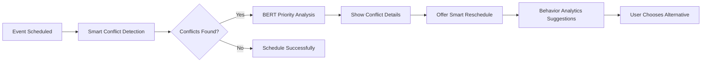

# Smart Time Slot Suggestion — Enhancement Plan (One‑Week Execution)

## 🎯 CLARIFIED FEATURE DISTINCTION

**SMART CONFLICT DETECTION vs SMART RESCHEDULE** - These are **complementary features** that work together:

### **🔍 Smart Conflict Detection (BERT-Enhanced)**
- **Purpose:** Intelligently detects and analyzes scheduling conflicts
- **Current State:** ✅ Implemented with BERT priority inference and severity classification
- **Intelligence:** Uses BERT for priority analysis, enhanced severity scoring, buffer-aware detection
- **Gap:** BERT insights not surfaced in UI; users don't see the "why" behind conflict analysis

### **🤖 Smart Reschedule (Behavior Analytics)**  
- **Purpose:** Suggests optimal alternative times based on user behavior patterns
- **Current State:** ✅ Implemented with UserBehaviorAnalyzer and productivity-aware scheduling
- **Intelligence:** Behavior pattern analysis, focus block alignment, conflict probability estimation
- **Gap:** Auto-applies first suggestion; users don't see options or reasoning

### **🔗 Integration Strategy**
**Unified Workflow:** Conflict Detection → BERT Analysis → Smart Reschedule Options → User Choice
- When conflicts detected, automatically offer smart reschedule alternatives
- Surface both BERT conflict reasoning AND behavior-based suggestions
- Let users choose from multiple options with full explainability

---

## 🤔 FEATURE CLARIFICATION: Smart Conflict### Day 2 — Smart Resche### Day 5 — Telemetry and Polish
- **Analytics:** Track suggestion acceptance rates, conflict resolution success
- **UI Polish:** Smooth animations, loading states, comprehensive error handling
- **Documentation:** Updated feature descriptions and user guides
- **Testing:** End-to-end workflow validation Multi-Option UI
- **Backend:** Enhance `/conflicts/smart-reschedule/{event_id}` response
  - Return top 5 alternatives with confidence scores and reasoning
  - Include conflict risk assessment for each suggested option
- **Frontend:** Replace auto-apply with selection modal
  - Show alternatives with confidence bars, risk badges, reasoning tooltips
  - "Why this time?" explanations for each suggestion
  - User chooses preferred alternative instead of auto-accepting firstection vs Smart Reschedule

**CURRENT IMPLEMENTATION ANALYSIS:**

Based on codebase analysis, here's what we actually have:

### **🔍 "SMART CONFLICT DETECTION" (Currently Implemented)**
- **Reality:** Basic overlap detection with severity classification
- **Location:** `/api/v1/conflicts/check` endpoint + `ConflictDetectionPanel.tsx`
- **Function:** Detects time overlaps, classifies severity (low/medium/high), suggests basic alternatives
- **"Smart" Elements:** 
  - BERT-powered priority inference (via `SmartConflictDetector`)
  - Severity classification based on priority levels
  - Buffer-aware overlap detection (±15 min)
- **UI:** Shows conflicts with priority levels, allows manual rescheduling

### **🤖 "SMART RESCHEDULE" (Currently Implemented)**
- **Reality:** AI-powered time slot suggestions using behavior analytics
- **Location:** `/api/v1/conflicts/smart-reschedule/{event_id}` + `UserBehaviorAnalyzer`
- **Function:** Suggests optimal times based on user patterns, preferences, productivity data
- **"Smart" Elements:**
  - Behavior pattern analysis
  - Productivity-aware scheduling
  - Conflict-free filtering
- **UI:** Auto-applies first suggestion (needs improvement)

### **🎯 THE REAL DISTINCTION:**

| Feature | What It Actually Does | Intelligence Level |
|---------|----------------------|-------------------|
| **Smart Conflict Detection** | Detects overlaps + BERT priority + severity | Moderate AI |
| **Smart Reschedule** | Suggests optimal times using behavior analytics | High AI |

### **🔧 WHAT NEEDS TO BE ENHANCED:**

1. **Smart Conflict Detection:** Already has BERT, just needs better UX
2. **Smart Reschedule:** Has good AI, needs multi-option UI instead of auto-apply
3. **Integration:** Connect them better in user flow

## 1) Executive Summary (UPDATED)

- **Strategic decision:** Enhance both existing features with better integration
  - **Smart Conflict Detection:** Improve UX to surface BERT insights and severity reasoning
  - **Smart Reschedule:** Replace auto-apply with choice-based UI showing confidence/reasoning
  - **Integration:** Make conflict detection automatically offer smart reschedule options
- **Timeline rationale:** Both features have solid AI foundations; focus on UX and integration
- **Academic contribution goals:**
  - Demonstrate seamless integration of conflict detection + intelligent rescheduling
  - Provide explainability for both conflict severity and reschedule suggestions
  - Show how BERT priority inference improves conflict resolution workflows

---

## 2) Current Architecture Analysis

### 2.1 Smart Conflict Detection (BERT-Enhanced)

**What It Actually Does:**
- Detects time overlaps using ±15 min buffer
- Uses BERT (`SmartConflictDetector`) for priority inference and severity classification
- Returns structured conflict data with affected events and basic alternatives

**Intelligence Components:**
- BERT-powered priority classification with confidence scoring
- Enhanced keyword fallback system
- Severity calculation based on priority levels and conflict impact
- Buffer-aware overlap detection

**Current UX Gap:** BERT insights and reasoning aren't surfaced in the UI

### 2.2 Smart Reschedule (Behavior Analytics)

**What It Actually Does:**
- Analyzes user behavior patterns via `UserBehaviorAnalyzer`
- Generates optimal time suggestions based on productivity patterns
- Filters suggestions through DB overlap check for conflict-free results
- Returns multiple alternatives with basic scoring

**Intelligence Components:**
- User behavior pattern analysis
- Productivity-aware time slot scoring
- Focus block alignment
- Conflict probability estimation

**Current UX Gap:** Auto-applies first suggestion without showing options/reasoning

### 2.3 Integration Opportunities



---

## 3) Enhanced Implementation Plan (Feature Integration)

### Day 1 — Smart Conflict Detection UX Enhancement
- **Backend:** Expose BERT reasoning in `/conflicts/check` response
  - Add `reasoning`, `confidence`, `priority_analysis` fields to conflict responses
  - Include conflict severity explanation ("High priority event conflicts with medium priority")
- **Frontend:** Surface BERT insights in ConflictDetectionPanel
  - Show "🧠 AI Analysis" section with priority reasoning
  - Display confidence bars for conflict severity assessments
  - Add "Why is this a conflict?" explanatory tooltips

### Day 2 — Frontend Suggestion UX
- Add `apiService.getSmartSuggestions(duration, preferred_date, title?, desc?)`.
- ConflictDetectionPanel: show a modal with multiple smart‑reschedule alternatives (reason, confidence bar, risk badge) instead of auto‑applying the first.
- QuickScheduler or new “Add Event” form: show “Suggested times” chips with “Why?” tooltips; “Use this time” fills the picker.

### Day 3 — Integration Flow Enhancement
- **Connect the features:** When conflicts detected, automatically show smart reschedule options
- **Unified UX:** Conflict panel seamlessly transitions to reschedule suggestions
- **Smart defaults:** Pre-select highest confidence, lowest risk alternative
- **Workflow:** Detection → Analysis → Options → Selection → Resolution

### Day 4 — New Event Smart Suggestions
- **New endpoint:** `POST /api/v1/suggestions` for proactive scheduling
- **Integration:** QuickScheduler shows "🤖 AI Suggestions" for new events
- **Prevent conflicts:** Suggest optimal times before conflicts occur
- **Behavior-aware:** Use existing UserBehaviorAnalyzer for suggestions

### Day 5 — Explainability, Docs, Demo Polish
- UI: “Why this time?” tooltips with reason stack; confidence bars; low/med/high conflict badges.
- Documentation: design, formulas, learning loop, evaluation methodology + early results.
- Record demo path; final QA.

Deliverables by day are tracked in repo issues/checklists; all changes are small, reviewable patches.

---

## 4) Academic Value Proposition

- Novel contributions to calendar AI:
  - Hybrid scoring that integrates BERT priority priors with interpretable heuristics and real‑time constraints (buffers, density, travel).
  - Lightweight online learning that adapts to user behavior without heavy model retraining.
  - Explainability for each suggestion via reason stacks and per‑factor contributions.
- Measurable evaluation metrics:
  - conflict‑free@k, acceptance@k (simulated and user‑driven), focus‑adherence rate, average buffer compliance, travel delta, scheduling latency.
- Dissertation impact statement:
  - The system articulates and validates a pragmatic, explainable, and adaptive AI approach to time‑slot recommendation under constraints, suitable for real‑world calendaring.

---

## 5) Feature Specifications

### 5.1 Enhanced scoring algorithms (backend)

- File: `backend/app/nlp/user_behavior_analytics.py`
  - Extend `_calculate_confidence_score_enhanced` with BERT priority, type affinity, density, and travel penalties.
  - Compute `calendar_density` as recent events per hour/day bucket.
  - Apply dynamic buffer when location change is detected; filter candidates violating buffers.
  - Expand `_generate_suggestion_reason_enhanced` to include a weighted “because” list (e.g., focus block match, low risk, high priority, low density).

Example snippet:

```python
if priority_level <= 2:
    score += 0.2 * (0.5 + 0.5 * priority_confidence)
if calendar_density > 0.6:
    score -= 0.15
if location_change:
    score -= 0.1
reason_parts.extend([
    'high-priority window' if priority_level <= 2 else '',
    'within focus hours' if in_focus_block else '',
    'low conflict risk' if conflict_prob < 0.2 else '',
    'light calendar density' if calendar_density < 0.3 else ''
])
```

### 5.2 Frontend UI components

- New `SmartSuggestionList` (modal/panel): renders suggestions with reason tooltips, confidence bars, and risk badges.
- ConflictDetectionPanel: integrate list for smart‑reschedule; let users choose among N alternatives.
- QuickScheduler: show suggestions for new events; “Use this time” fills start/end.

### 5.3 API endpoints and functionality

- New endpoint: `POST /api/v1/suggestions`
  - Request JSON:
    ```json
    { "cognito_sub": "<user>", "duration_minutes": 60, "preferred_date": "2025-08-15T00:00:00Z", "title": "Design Review", "description": "UI/UX sync" }
    ```
  - Response JSON:
    ```json
    {
      "suggestions": [
        {"start_time": "...", "end_time": "...", "confidence": 0.82, "reason": "...", "conflict_risk": "Low"}
      ]
    }
    ```
- Existing reschedule endpoint improved: `/api/v1/conflicts/smart-reschedule/{event_id}` now returns multiple alternatives with reasons/confidence.

### 5.4 User experience improvements

- Clear “Why this time?” on hover.
- Confidence meter and conflict risk badge (Low/Med/High).
- “Accept suggestion” flows update calendars instantly and feed learning.

---

## 6) Evaluation Framework

### 6.1 Synthetic data methodology

- Archetypes: early_bird, night_owl, balanced, remote_worker, field_worker, manager.
- Variability: focus blocks, lunch windows, commute/travel patterns, location mixes.
- Generate 60–90 days history per user; simulate event creation + reschedule scenarios.

### 6.2 Performance metrics

- conflict‑free@k (k ∈ {1,3,5})
- acceptance@k (simulated by matching affinity thresholds; corroborated by UI telemetry).
- focus‑adherence rate, buffer compliance, travel delta (minutes), density normalization.
- Time‑to‑schedule reduction (UX impact).

### 6.3 Ablation study design

- Baseline: preference fit + conflict risk only.
- +BERT: add BERT priority and type affinity.
- +Density: add calendar density penalty.
- +Travel: add location‑change/buffer penalty.
- +Learning: enable per‑user online weights.

Pseudo‑evaluation outline:

```python
for config in configs:  # baseline, +bert, +density, +travel, +learning
    set_flags(config)
    for user in users:
        hist = gen_history(user)
        for task in tasks:
            suggs = suggest(user, task)
            metrics.update(evaluate(suggs, hist, task))
report(metrics)
```

---

## 7) Risk Mitigation

- Risks & solutions:
  - Time constraint: avoid training new models; use hybrid scoring + BERT priors.
  - Data sparsity: fall back to business hours and conservative risk; use synthetic data for robust testing.
  - UI complexity: a single reusable suggestion modal; progressive enhancement.
  - Overfitting weights: keep weights bounded and validated via ablation; store per‑user safely.
- Fallback strategies:
  - Default business‑hour slots with medium confidence; conflict probability heuristic when DB fails.
  - If BERT unavailable, skip BERT features and continue scoring.
- Quality assurance measures:
  - Unit tests for scoring and endpoints; schema validation; lint/type checks.
  - UI smoke tests for suggestion flows; manual demo script.

---

### Appendix: Quick Reference

- Core files to modify:
  - `backend/app/nlp/user_behavior_analytics.py` (scoring, reasons, learning hooks)
  - `backend/app/api/` (new `/suggestions`, enhance `/conflicts/smart-reschedule/...`)
  - `frontend/src/services/apiService.ts` (new suggestions method)
  - `frontend/src/components/...` (Suggestion list/modal; ConflictDetectionPanel; QuickScheduler)
- Environment:
  - BERT offline already verified; no external calls required.
- Demo script:
  1) Create a new event via QuickScheduler, open suggestions, accept a slot.
  2) Trigger a conflict; open smart‑reschedule; pick among alternatives.
  3) Show “Why this time?” explanations and confidence/risk.
  4) Show evaluation summary from synthetic harness.
